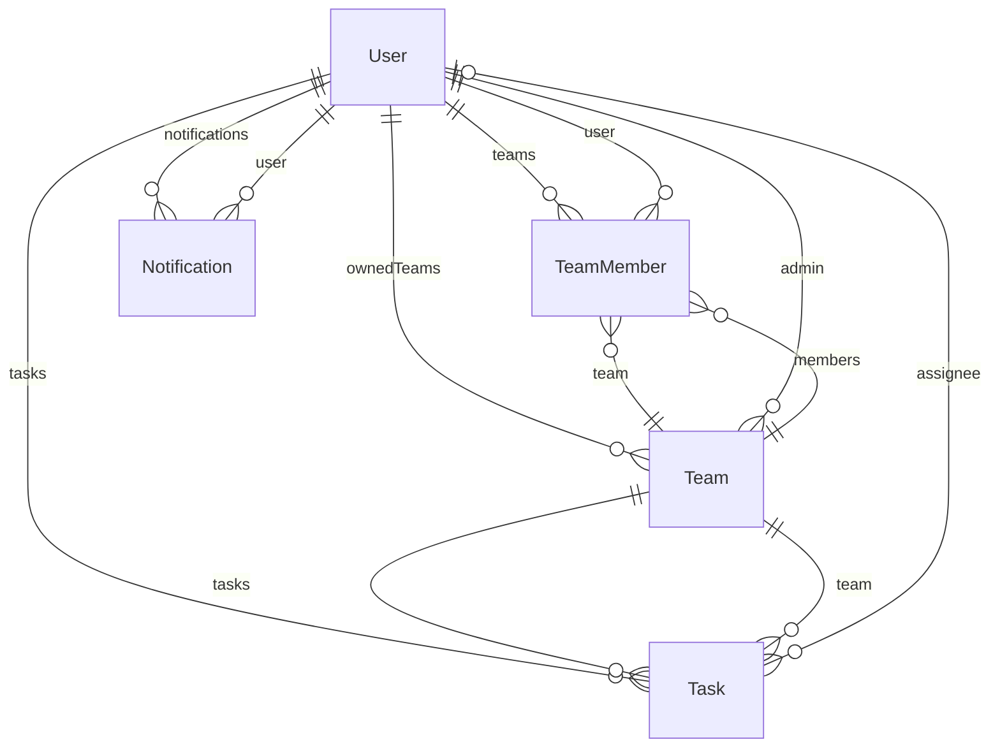

# Syncly Database Schema Reference

> [!NOTE]
> This documentation is automatically generated from [`backend/schema.prisma`](../backend/schema.prisma).
> Do not edit this file manually. It is kept in sync by the daily maintenance workflow.

## Entity-Relationship Diagram

## Data Models

### `User`

| Field | Type | Attributes | Notes |
| :--- | :--- | :--- | :--- |
| `id` | `Int` | `@id @default(autoincrement())` | - |
| `username` | `String?` | `@unique` | - |
| `email` | `String` | `@unique` | - |
| `name` | `String` | - | - |
| `avatarUrl` | `String?` | - | - |
| `password` | `String` | - | - |
| `createdAt` | `DateTime` | `@default(now())` | - |
| `updatedAt` | `DateTime` | `@updatedAt` | - |
| `teams` | `TeamMember[]` | - | - |
| `tasks` | `Task[]` | - | - |
| `ownedTeams` | `Team[]` | - | - |
| `notifications` | `Notification[]` | - | - |

### `Team`

| Field | Type | Attributes | Notes |
| :--- | :--- | :--- | :--- |
| `id` | `String` | `@id @default(uuid())` | - |
| `name` | `String` | - | - |
| `adminId` | `Int` | - | - |
| `createdAt` | `DateTime` | `@default(now())` | - |
| `updatedAt` | `DateTime` | `@updatedAt` | - |
| `admin` | `User` | `@relation(fields: [adminId], references: [id])` | - |
| `members` | `TeamMember[]` | - | - |
| `tasks` | `Task[]` | - | - |

### `TeamMember`

| Field | Type | Attributes | Notes |
| :--- | :--- | :--- | :--- |
| `id` | `Int` | `@id @default(autoincrement())` | - |
| `userId` | `Int` | - | - |
| `teamId` | `String` | - | - |
| `role` | `String` | `@default("Member")` | Admin, Member |
| `status` | `String` | `@default("Pending")` | Active, Pending |
| `joinedAt` | `DateTime` | `@default(now())` | - |
| `user` | `User` | `@relation(fields: [userId], references: [id])` | - |
| `team` | `Team` | `@relation(fields: [teamId], references: [id])` | - |

**Indexes / Constraints:**
- `@@unique([userId, teamId])`

### `Task`

| Field | Type | Attributes | Notes |
| :--- | :--- | :--- | :--- |
| `id` | `Int` | `@id @default(autoincrement())` | - |
| `title` | `String` | - | - |
| `description` | `String?` | - | - |
| `status` | `String` | `@default("To Do")` | - |
| `priority` | `String` | `@default("Medium")` | - |
| `dueDate` | `DateTime?` | - | - |
| `teamId` | `String` | - | - |
| `assigneeId` | `Int?` | - | - |
| `assigneeIds` | `Int[]` | `@default([])` | - |
| `createdAt` | `DateTime` | `@default(now())` | - |
| `updatedAt` | `DateTime` | `@updatedAt` | - |
| `team` | `Team` | `@relation(fields: [teamId], references: [id])` | - |
| `assignee` | `User?` | `@relation(fields: [assigneeId], references: [id])` | - |

### `Notification`

| Field | Type | Attributes | Notes |
| :--- | :--- | :--- | :--- |
| `id` | `Int` | `@id @default(autoincrement())` | - |
| `userId` | `Int` | - | - |
| `type` | `String` | - | - |
| `message` | `String` | - | - |
| `teamId` | `String?` | - | - |
| `taskId` | `Int?` | - | - |
| `read` | `Boolean` | `@default(false)` | - |
| `createdAt` | `DateTime` | `@default(now())` | - |
| `user` | `User` | `@relation(fields: [userId], references: [id])` | - |

